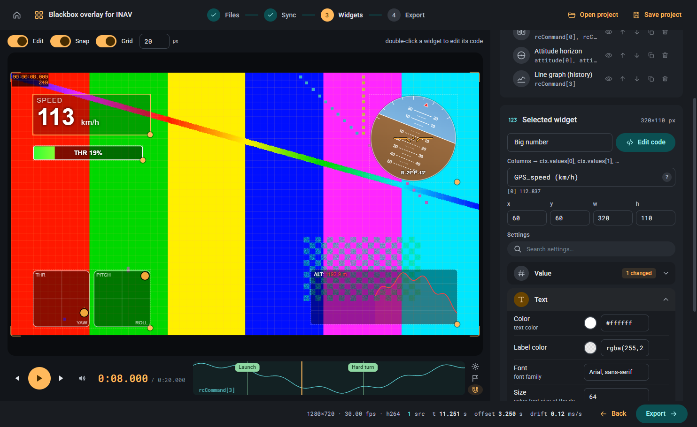

# Blackbox overlay for INAV

Desktop app that draws telemetry widgets from INAV blackbox logs over your FPV video.
Widgets are small HTML/JS snippets you write yourself (read-only examples are included).

The app does one thing only: add widgets to a video and export the result.
No editing, trimming or effects.

## Workflow

1. **Open video** – any common format; a preview proxy is made automatically.
2. **Open blackbox** – CSV or raw `.txt` / `.bbl` log (decoded with `blackbox_decode`), several files can be combined.
3. **Synchronise** – set offset and drift by hand, or use auto sync (optical flow or a Gyroflow project).
4. **Add and edit widgets** – start from an example or write your own code in the editor, adjust its settings in the form, place it on the video.
5. **Export** – burn the overlay into a video with ffmpeg, or write a PNG frame sequence.

Manuals: [Creating widgets](manual/widgets.md) · [Synchronising video and blackbox](manual/synchronisation.md)

## Disclaimer

This application was vibe-coded: the whole codebase was written by AI (Claude Code) from prompts.
Expect rough edges, use at your own risk.

## Screenshot

## License

GNU General Public License v3.0 – see [LICENSE](LICENSE).
