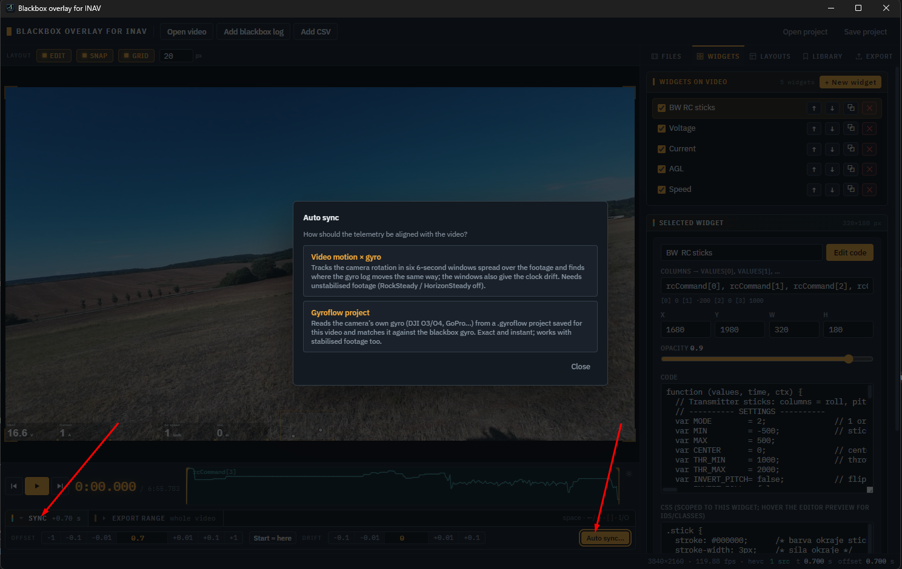

# Synchronising video and blackbox

The camera and the flight controller start recording at different moments and their clocks run at slightly different speeds.
Synchronisation tells the app which blackbox time belongs to each video frame; without it the widgets show data from the wrong moment.

## Two numbers describe the sync

- **Offset**: how many seconds of blackbox time correspond to the first video frame.
- **Drift**: how many milliseconds the blackbox clock gains per second of video. It is small (typically 0.04 to 1 ms/s) but adds up: 1 ms/s is 0.4 s after a 7-minute flight.

Both are stored in the project and shown in the **Sync** drawer of the sync bar.

## Manual sync

1. Find a moment visible in both sources: arming, the take-off, a sharp turn. The timeline under the video draws one telemetry column (**Trace column**, gear icon) to help.
2. Seek the video to that moment and set the offset with the stepper (±0.01 / ±0.1 / ±1 s, or the `[` and `]` keys) until the widgets match the picture.
3. **Start = here** sets the offset so that the blackbox starts at the current frame; useful when the log begins with arming.
4. Check a moment near the end of the video. If the widgets lag or lead there, adjust **Drift** until both ends match.

## Automatic sync

**Auto sync** in the sync bar measures offset and drift by comparing how fast the camera rotates with the gyro in the blackbox.
It picks several short windows across the flight, matches each against the whole log and fits one straight line through them.
It needs a flight with some rotation; smooth cruising gives weak matches.

Two methods are offered:

### Video motion × gyro

The camera rotation is estimated from the picture itself (optical flow on a few seconds of frames).
Works with any camera and takes about 20 to 70 s, depending on resolution.

**Not usable with stabilised video.** RockSteady, HorizonSteady, HyperSmooth or Gyroflow output has the camera motion removed from the picture, so there is nothing to match.
Use the goggles DVR or the unstabilised original instead, or the method below.

### Gyroflow project

DJI O3/O4 air units, GoPro and Insta360 cameras record their own gyro inside the video file.
[Gyroflow](https://gyroflow.xyz) reads it; save the project there (**Export project**, gyro data included, the default) and the app uses that gyro instead of the picture.
Because the gyro belongs to the camera, not the picture, this works with stabilised footage too, and it takes about 2 s.

1. In Gyroflow open the video and save the project next to it (`<video>.gyroflow`); the app finds it automatically, otherwise click **Open…** in the dialog and pick it.
2. Choose **Gyroflow project**, check that the three gyro columns are filled (`gyroADC[0..2]` are found automatically), click **Analyse**.
3. Review the windows: match values near 1.0 are good, a **windows disagree** or **this window is ambiguous** warning means one window matched a wrong place; click it to inspect.
4. **Apply** writes the offset and drift into the sync bar. Verify by scrubbing to a fast manoeuvre.

The same steps apply to *Video motion × gyro*, only without the Gyroflow file.
