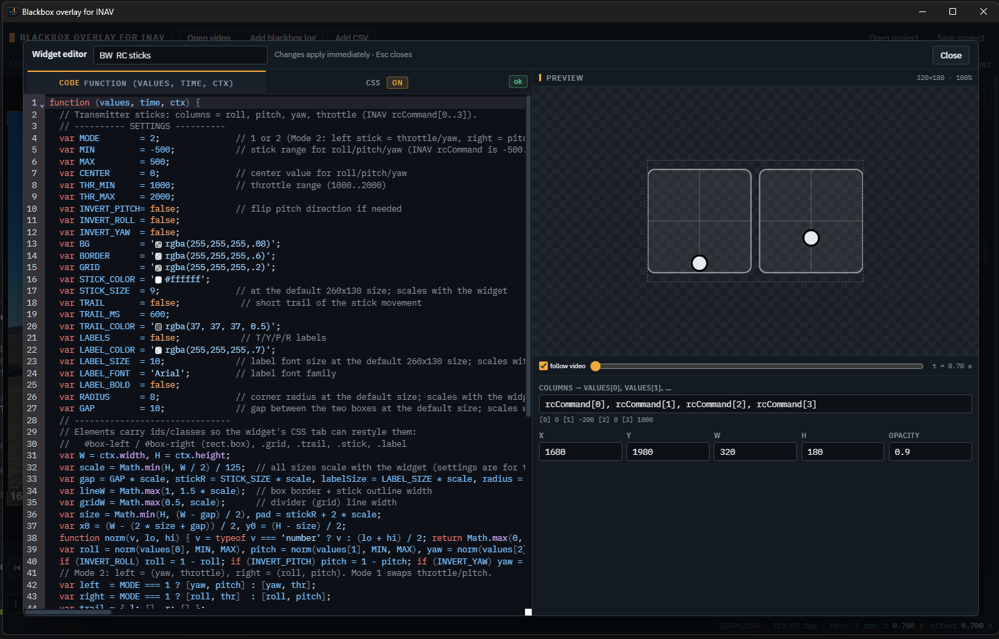

# Creating widgets

A widget is a small piece of code that draws one thing over the video: a number, a gauge, a graph, a map, a horizon.
The app only feeds it data from the blackbox; what it looks like is entirely up to the code.

## What a widget is made of

- **JavaScript**: one function that receives the current telemetry values and returns HTML.
- **SVG**: any shape, arc, path or chart can be drawn inline in the returned HTML.
- **CSS**: optional stylesheet for the widget; it applies only to that widget's box.

Anything a browser can draw, a widget can draw. There is no fixed list of widget types.

## Where to start

1. Open the **Library** tab and unfold **Examples**. Each example starts with a `SETTINGS` block (colours, units, sizes) meant to be edited.
2. Click **Add** next to an example to put it on the video, then **Edit code** to change it. **Save to library** keeps your version.
3. In the **Widgets** tab, set **Columns** to the blackbox columns the widget reads; they arrive as `values[0]`, `values[1]`, ...
4. Drag and resize the widget on the video. Its size is available to the code, so draw relative to it.

The full list of what the code receives (interpolated values, history, statistics, state, images) is under **Widget API reference** in the Widgets tab.

## The easy way: let AI write it

Writing widget code by hand is not necessary. The repository contains a skill for [Claude Code](https://claude.com/claude-code) in `.claude/skills/widget/`
that holds the complete widget contract, design rules, a template and a test runner.

1. Open the repository folder in Claude Code.
2. Type `/widget` followed by what you want, for example: `/widget battery voltage with a bar that turns red under 3.5 V per cell`.
3. Paste the result into a new widget (**+ New widget** in the Widgets tab, then **Edit code**) and set its columns.

The skill also modifies existing widgets: paste your code and describe the change.
